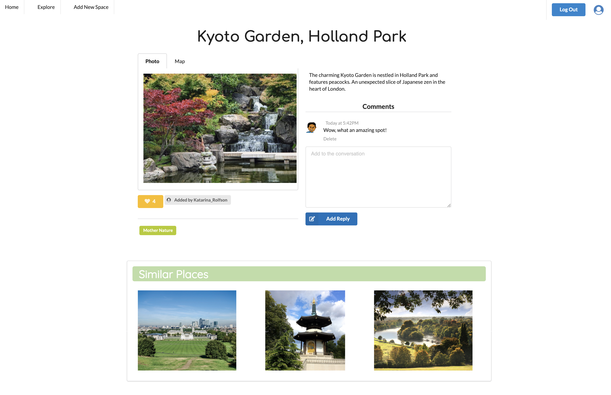

<!--  -->


# General Assembly Project 3: CitySpace

## Project Brief
For the third project as part of GA's Software Engineering Immersive course I worked in a group of four.

The objective here was to build our first full-stack application, using an Express API to serve our data from a Mongo database and consuming the API with a separate React-built frontend.

Our aim was to build a complete product with multiple relationships, CRUD functionality on multiple models and finished with a visually impressive design.

## Timeframe
9 days

## Technologies Used

* HTML5
* MongoDB
* Mongoose
* React.js
* Express
* React Router DOM
* JavaScript
* Mapbox
* Sass
* Node
* Git / GitHub
* Insomnia
* Semantic UI React
* Axios
* Google Fonts
* Cloudinary
* React-slick
* Postcodes.io

## Deployed Version

[CitySpace]()

Please feel free to create an account or login with the following credentials:

email: ricky@ricky.com\
password: pass

## Code Installation


## Contributors
* Edwyn Abi-Acar
* Elsie Down
* Tobi Lesi

## App Overview

CitySpace is a platform for discovering and sharing unique and interesting locations in and around London.

At a time when many of us aren't able to socialise indoors, CitySpace offers ideas of new places to checkout. Explore a range of 'spaces' based on what interests you, whether you're looking for stunning architecture, somewhere lively or perhaps just a bit of peace and quiet.

Once you've created a profile, you can save your favourites spaces, comment on existing spaces and even add your own.

### Landing Page / Homepage

After navigating through to the homepage, a slider showcases this month's featured spaces chosen by CitySpace. 

A map section then lists all spaces by their location. Hover each icon to see the name of the space and a preview image.

The Recommended section appears once a user is logged in, providing suggestions of spaces to checkout based on your interests.

The final section links you through to each different category.


### Show Page

The show page features a tab section allowing you to toggle between an image of the space and its location on the map. 

See who added the space, similar spaces based on categories, favourites and comments. Once logged in you can add your own comment and favourite the space. If you created the space, you have the option to edit or delete the space.



### Explore

Browse all spaces by category. Categories include Art & Design, Sports & Leisure and Mother Nature.


### Profile page

View your saved categories and the spaces you've created or favourited on your profile page.


### Forms

Register, Login, Create and Edit forms, complete with error messaging to notify you if something's wrong.


## Process

### Planning

Having settled on the idea of creating a platform for sharing locations, we moved onto mapping out the user journey and possible ideas for features and presentation.

From this stage we were able to produce a wireframe of the app, giving us a clear idea of our data model and any pages we would need to produce to achieve our overall objective.

### Trello

We used to Trello to break the project down into specific manageable tasks and this formed the basis of our planning throughout the project.

Meeting regularly on Zoom, we would update the Trello board by prioritising tasks, assigning cards to each team member and updating the status of cards, from 'In Progress' to 'Completed' for example.  We labelled cards as either front or back end tasks, and ensured each card was updated with comments, links and other useful bits of information.

Being able to view our project as a Kanban board was crucial to our success with this project. It helped to streamline our communication and overcome many of the additional challenges presented by working remotely.


## Development

### Back End

We used Mongoose to interact with our database and designed our main model to include embeded 'comments' data, as well as referenced data in the form of 'owner' and 'favouritedBy' fields:

```
const citySpaceSchema = new mongoose.Schema({
  name: { type: String, required: true, unique: true },
  description: { type: String, required: true, maxlength: 800 },
  image: { type: String, required: true },
  location: { type: Object, required: true },
  owner: { type: mongoose.Schema.ObjectId, ref: 'User', required: true  },
  comments: [commentSchema],
  favouritedBy: [{ type: mongoose.Schema.ObjectId, ref: 'User', required: true }],
  tags: [{ type: String, required: false }],
})
```

### Front End

One feature I worked on was building the Create and Edit forms, allowing users to add and update their own 'spaces'.

We used the postcodes.io API to convert the postcode entered by the user to an object containing longitude and latitude coordinates. This was neccessary because this data was required by our mapbox integration and would allow an icon to display the specific location on a map.

Upon submiting the form data, we made the call to the API requesting the longitude/latitude data. Spreading the formdata, we updated the location field to contain the newly received longitude and latitude before creating the new space:

```
const handleSubmit = async event => {
  event.preventDefault()
  console.log(errors)
  try {
    const longLat = await getLongLat(formdata.location)
    const newSpace = { ...formdata, location: longLat }
    const { data } = await createSpace(newSpace)
    history.push(`/spaces/${data._id}`)
  } catch (err) {
    setErrors(err.response.data.errors)
    console.log(err.response.data.errors)
  }
}

```

On the Show page, we used a combination of [Semantic UI React](https://react.semantic-ui.com/) and conditional rendering to create a tabular display, allowing the us
to toggle between viewing the image and map views.

```
<div className="ui attached tabular menu">
  <div className={photoTab ? 'active item' : 'item'}>
    <div onClick={handlePhotoTab}> Photo </div>
  </div>
  <div className={photoTab ? 'item' : 'active item'}>
    <div onClick={handlePhotoTab}> Map </div>
  </div>
</div>

{photoTab ?
  <div className="ui bottom attached segment active tab">
    </img>
  </div>
  :
  <div className="ui bottom attached segment active tab">
    <div className="showpage-map-wrapper">
      <SpaceShowMap space={space} />
    </div>
  </div>
}
```


### Styling

In the early design phase of our project, I produced a simple visual mockup in Google Docs which helped to communicate some of my ideas in terms of the colour scheme, imagery and typeface. 


We also used the [Airbnb website](https://www.airbnb.co.uk/) as a visual reference which helped to inform a number of our styling decisions.

Many components featured on CitySpace are taken from Semantic UI React.


## Reflection

### Key Learnings:

* **MERN app structure:** Building, planning and deploying a full-stack MERN application gave me a deeper understanding of the structure of this kind of web application. I'm now able to use this project as a valuable tool for referencing each section with knowledge of how each part interacts with each other.

* **Sprint planning:** Clearly defining what we wanted to achieve within a set timeframe was essential for working in a group of 4 and gave us an insight into how the way in which some companies structure their time.

### Challenges

* **Team Git:** This project introduced us to an entirely new way of working, helping us to become familiar with the concept of branches. This was a significant change to our workflow up until that point in the course, but the process of merging and resolving conflicts soon became a part of our daily routine.

### Wins

* **Group dynamic:** We worked well as a team, striking a good balance between solo working and group/pair-coding on some of the bigger, more complex tasks. We also managed our tasks effectively, ensuring each team member was given the opportunity to work across both the front and back end.

### Future Improvements

* **Gallery:** We initially discussed the idea of creating a gallery reel feature on the Show page, allowing users to provide additional images to any space. This was dropped due to time constraints, but were we to expand CitySpace this would be a valuable addition to the app. 


